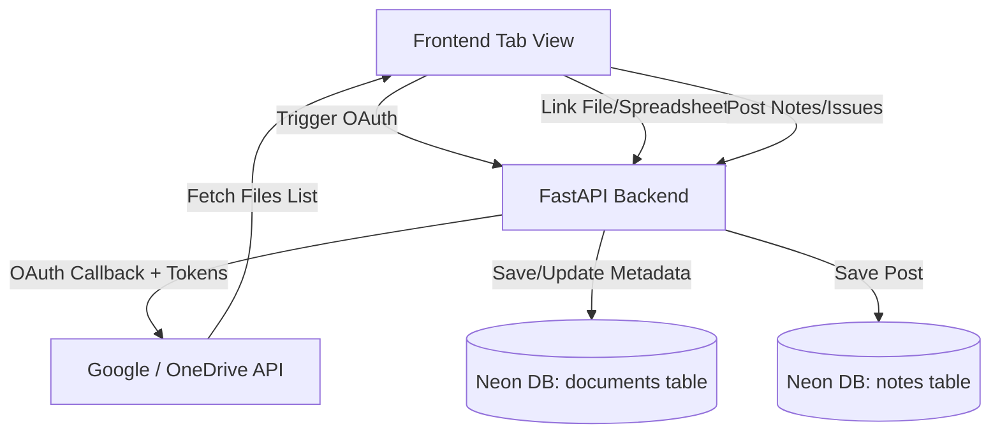

# FieldOps System Guide: Tab Operations, Database & Cloud Drive Interactions

This guide explains how each tab in the FieldOps project workspace is structured, how it operates on the frontend, and how it interacts with the backend database and cloud drive storage integrations (Google Drive and OneDrive).

---

## 1. Global Cloud Integration & Document Flow

Every tab except the **BoQ tab** uses standard document metadata linking. The system architecture coordinates frontend requests, backend API routes, OAuth providers, and PostgreSQL tables (Neon DB) as follows:

* **Linking Metadata**: Rather than copying the entire physical file contents into the database, the system stores file metadata (`title`, `file_url`, `file_type`, `cloud_file_id`, `origin`, and `department`) in the `documents` table.
* **Unlinking**: When you click **Unlink** (not delete), the frontend calls `POST /projects/{projectId}/documents/{documentId}/unlink`. The database sets `is_linked = False` and logs the current time in `unlinked_at`. The file disappears from active UI lists, but history is preserved.
* **Relinking (Duplicate Prevention)**: When you relink the same file, the backend checks for a record matching the same `cloud_file_id` or `file_url`. If it exists, it reactivates the record by setting `is_linked = True`, setting `linked_at = func.now()`, and clearing `unlinked_at`, avoiding duplicate database rows.

---

## 2. Tab-by-Tab Breakdown

### Tab 1: Bill of Quantities (BoQ)
Manages the structured list of project costs, tasks, and rates. This is the core reference module.

* **What it has**:
  * **Integrations panel** (`BoqIntegrations.tsx`): Restricted to scan and link Excel spreadsheets only.
  * **BOQ Document List** (`BoqDocumentList.tsx`): Shows active BoQs linked to the project.
  * **Structured Items Sheet Editor** (`EmbeddedSheetEditor.tsx`): Inline view of imported tasks, categories, quantities, rates, and totals.
* **Drive Interaction**:
  * Requests only files of type `spreadsheets`.
  * Triggers backend cell-by-cell scanning of the selected worksheets (`POST /integrations/{id}/sync-import`) to parse standard columns (`Description`, `Qty`, `Rate`, `Amount`).
* **Database Interaction**:
  * Mapped workbook OAuth credentials are saved in `project_integrations`.
  * Imported BoQ files are saved in `boq_documents`.
  * Parsed BoQ line items (categories, items, rates, quantities) are saved in `boq_items`.

---

### Tab 2: Interim Payment Certificates (IPCs)
Tracks contractor claims and certified payment amounts for completed site works.

* **What it has**:
  * **Claims Banner & Summary**: Total claimed vs certified amounts.
  * **Spreadsheet Integrations Panel** (`DocumentIntegrations.tsx`): Connects to cloud files.
  * **Certificates List Table**: Live list of certificates, certified amounts, status (Draft, Submitted, Certified, Paid), and dates.
  * **Discussion Feed**: Notes, updates, or issues flagged regarding payment claims.
  * **Linked IPC Documents List**: Shows spreadsheets linked to the IPC module.
* **Drive Interaction**:
  * Restricts document list to Excel workbooks (`spreadsheets` filter).
  * Spreadsheet editing is conducted via external links.
* **Database Interaction**:
  * Mapped integrations are saved in `project_integrations`.
  * Individual certificates and verification values are saved in `ipcs`.
  * Logged notes or claim issues are saved in `notes` (with `department="IPC"`).
  * Linked workbook metadata is saved in `documents` (with `department="IPC"`).

---

### Tab 3: Project Budgets
Tracks cost limits and baseline estimates for project monitoring.

* **What it has**:
  * **Integrations Panel** (`DocumentIntegrations.tsx`): Connects to cloud files.
  * **Discussion Feed**: Logs discussions, allocations updates, and budget issues.
  * **Linked Budget Documents List**: Displays all formats of budget files.
* **Drive Interaction**:
  * Set to `all` file formats. You can link PDF cost plans, Word doc reports, folders, or Excel files.
* **Database Interaction**:
  * Discussion notes and issues are saved in `notes` (with `department="BUDGET"`).
  * Linked budget files are saved in `documents` (with `department="BUDGET"`).

---

### Tabs 4 - 7: Departments (Engineering & Tech, Field Operations, HR, Legal)
Each department acts as a collaborative workspace tailored to its operational domain.

#### A. Engineering & Tech
* **Details**: Stores technical specifications, drawings, blueprints, and calculation models.
* **DB Tag**: Notes and documents are tagged with `department="Tech"`.
* **CAD blueprint feature**: Since `.dwg` and CAD blueprints cannot be previewed in web iframes, the tab uses a helper `isCadFile` to detect them. It disables the preview iframe, displays a custom warning card, and provides a direct CTA to **Open CAD File in Workspace**.

#### B. Field Operations
* **Details**: Manages logs, equipment, rosters, site diaries, delays, and contractor sheets.
* **DB Tag**: Notes and documents are tagged with `department="Field Operations"`.

#### C. Human Resources (HR)
* **Details**: Roster spreadsheets, labor compliance reports, and onboarding sheets.
* **DB Tag**: Notes and documents are tagged with `department="HR"`.

#### D. Legal & Compliance
* **Details**: Permits, licensing, environmental impact records, contracts, and legal alerts.
* **DB Tag**: Notes and documents are tagged with `department="Legal"`.

---

## 3. Database Table Definitions Reference

Here is how the tables in your PostgreSQL database map to the tab operations:

| Table Name | Description | Key Fields | Tab Associations |
| :--- | :--- | :--- | :--- |
| `projects` | Project directory | `id`, `name`, `description` | Parent to all tabs |
| `project_integrations` | Active cloud integrations | `id`, `provider`, `spreadsheet_id`, `sheet_name`, `boq_name`, `last_synced_at` | BoQ, IPC, Budget, and Departments |
| `boq_documents` | Parent reference for parsed BoQs | `id`, `name`, `project_id`, `created_at` | BoQ tab only |
| `boq_items` | Individual BoQ cells / item rows | `id`, `category`, `description`, `qty`, `rate`, `amount` | BoQ tab only |
| `ipcs` | Claims records | `id`, `certificate_number`, `amount_claimed`, `amount_certified`, `status` | IPC tab only |
| `notes` | Standard discussions and logged issues | `id`, `content`, `department` (e.g. `Tech`, `HR`, `IPC`, `BUDGET`), `is_issue`, `priority` | IPC, Budget, Tech, Field Ops, HR, Legal |
| `documents` | Metadata for linked files | `id`, `name`, `file_url`, `file_type`, `department` (e.g. `Tech`, `IPC`, `BUDGET`), `is_linked`, `linked_at`, `unlinked_at` | IPC, Budget, Tech, Field Ops, HR, Legal |
